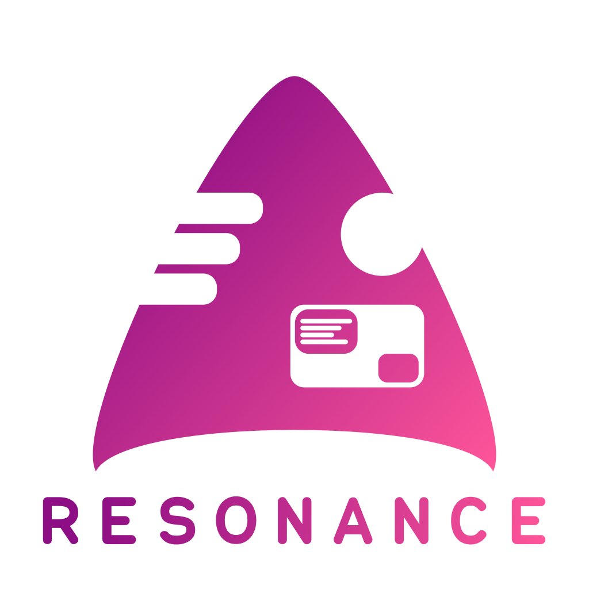

  <div align="center">
    
    <h1><b>R E S O N A N C E - A R C H</b></h1>
	  <p><b>A linux distribution based on Arch Linux designed for digital forensics and penetration testing.</b></p>
</div>


> **NOTE**  <br/>We are not responsible for our users, we only give them the tools to use **NOT for selfish purposes**.


<h1 align="center"><b>D E M O</b></h1>

<div align="center">
  
</div>


<h1 align="center"><b>T H E M E S</b></h1>

<div align="center">
  
</div>

```bash
theme -n <theme_name>  # command to change theme
```

### **AVAILABLE THEMES** ###
  - `cyberpunk` - `theme -n cyberpunk`
  - `trains` - `theme -n trains`
  - `default` - `theme -n default`
  - `dark theme` - `theme -n dark theme` (**unavailable**)


<h1 align="center"><b>B U I L D I N G</b></h1>

Run `steps.sh` located in AWM-Resonance-Arch as root.


### **WHEN ITS DONE** ###
- **LiveCD Login**: resonance
- **LiveCD Passwd**: resonance
- **LiveCD Root Passwd**: toor


<h1 align="center"><b>F A Q</b></h1>

  - Will this be available on **Debian**? - yes, it will
  - When will this be released? - after i come back from holiday
  - How do i install the system? - `sudo calamares`
  - Why is it slow on old hardware? - because its not released yet (vicsave: buy new pc)
  - Where are all the forensics and penetration testing tools? - its not release yet, be patient

<h1 align="center"><b>C O N T R I B U T O R S</b></h1>

- [**cronos-hash**](https://github.com/cronos-hash)
- [**vicsave (Victoria Savelyeva)**](https://github.com/vicsave)
